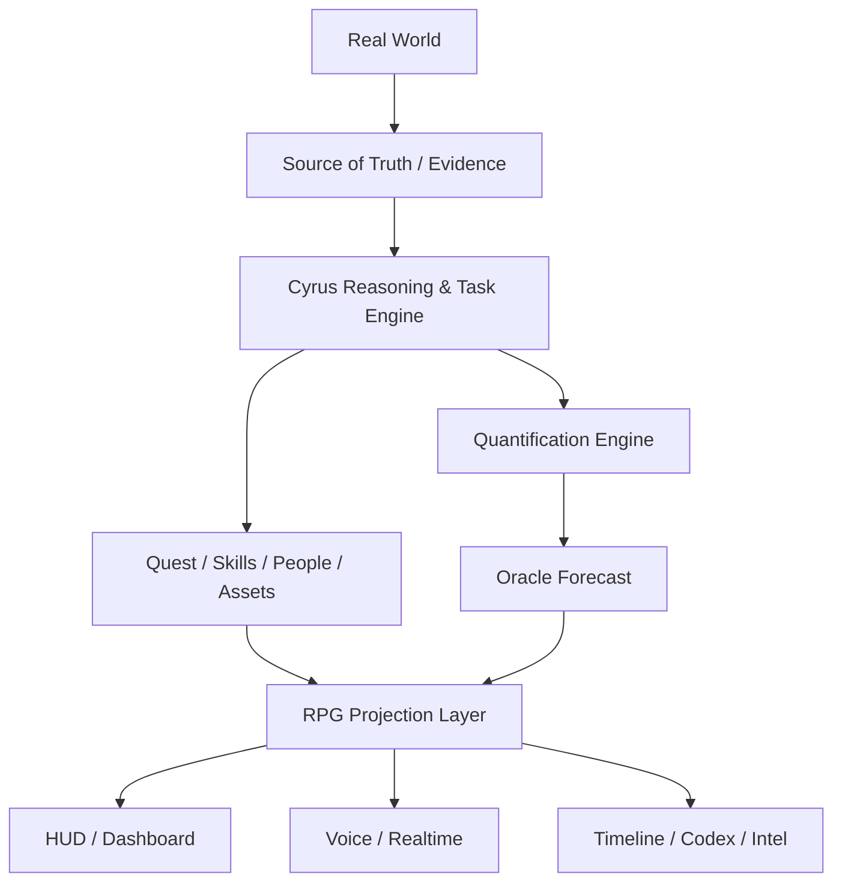

<p align="center">
  
</p>

<p align="center">
  <strong>把现实世界里的任务、能力、资源、关系、风险和成长，变成一套可观察、可计算、可推进的 RPG 系统。</strong>
</p>

<p align="center">
  
  
  
  
</p>

<p align="center">
  <a href="#它是什么">它是什么</a> ·
  <a href="#核心系统">核心系统</a> ·
  <a href="#oracle--quantification-engine">Oracle</a> ·
  <a href="#cyrus-会怎么说话">交互方式</a> ·
  <a href="docs/ROADMAP.md">Roadmap</a>
</p>

---

## 它是什么

**Reality RPG** 不是一款传统游戏。

它是一套把现实生活按照 RPG 的方式重新组织、量化和呈现的个人管理系统：任务可以成为 Quest，能力可以形成 Skill Tree，真实设备和资源可以进入 Equipment，重要经历可以解锁 Achievement，风险和结果则可以通过 Oracle 进行概率推演。

这套系统目前作为私人 AI 助理 **Cyrus** 的衍生功能进行设计。Cyrus 负责理解现实中的任务、数据和状态，Reality RPG 负责把这些信息压缩成更直观的 **HUD、Quest、Skill、Achievement、Map、People Network 和 Forecast**。

> **Game language is the interface. Reality remains the source.**  
> 游戏语言是界面，现实世界才是数据源。

它不会因为“像游戏”就把推测包装成事实。所有数字都尽量区分：

```text
MEASURED    实际测量
CALCULATED  公式计算
ESTIMATED   模型估计
```

所有信息状态也区分：

```text
CONFIRMED   已确认
REPORTED    当事人陈述
INFERRED    系统推断
FORECAST    概率预测
UNKNOWN     未知
WARNING     风险提示
```

---

## 为什么想做这个东西

现实中的很多重要变化其实很难“看见”。

你可能知道自己最近在健身、在学习、在推进项目，但很难快速回答：

- 我到底进步了多少？
- 现在最值得做的事情是什么？
- 一个目标距离完成还有多远？
- 某个计划有多大概率成功？
- 我现在缺的是时间、钱、能力，还是信息？
- 哪些人是关键协作者、决策者或阻塞点？
- 过去一年到底发生过哪些值得记住的“第一次”？

RPG 在这方面做得非常好。

它会把长期、复杂、模糊的变化，压缩成：

```text
等级 · 经验值 · 技能 · 装备 · 任务 · 进度 · 风险 · 成就 · 地图 · 状态
```

Reality RPG 想借用的就是这种能力。

---

# 核心系统

## 1. HUD｜现实世界的即时信息层

HUD 不追求“信息越多越好”，而是回答五个问题：

1. 我现在是什么状态？
2. 当前最重要的任务是什么？
3. 有什么风险或阻塞？
4. 下一步应该做什么？
5. 长期成长有没有发生？

概念示例：

```text
VICTOR // PRINCIPAL

Active Quests        12
Critical             2
Blocked              3
Waiting              4

Energy               76%
Task Load            68%

MAIN QUEST
████████████░░░░ 74%

Danger               III
Success Probability  72%
Confidence           Medium
```

> 上面只是界面概念，不代表当前已经拥有全部这些实时数据。

---

## 2. Quest System｜现实任务变成任务链

现实里的待办不会只是一张平铺的 To-do List。

任务可以被组织成：

- **Main Quest** — 长期主线
- **Quest Chain** — 连续任务链
- **Side Quest** — 支线任务
- **Training Quest** — 学习 / 训练
- **Timed Quest** — 限时任务
- **Event Quest** — 事件触发
- **Hidden Quest** — 系统从证据里发现的重要任务
- **Boss Quest** — 高难度关键节点
- **Daily Quest** — 日常行为
- **Maintenance Quest** — 维持型任务

一个 Quest 可以包含：

```text
Progress
Next Action
Deadline
Blockers
Waiting On
Dependencies
Difficulty
Danger
Success Probability
Failure Consequence
```

### Priority：四象限，不只是 P0 / P1

| | 紧急 | 不紧急 |
|---|---|---|
| **重要** | **Q1 · CRITICAL** | **Q2 · STRATEGIC** |
| **不重要** | **Q3 · REACTIVE** | **Q4 · OPTIONAL** |

四象限负责分类；后台的 Quantification Engine 再根据 Deadline、后果、战略价值、依赖关系、可逆性和机会成本进行细排序。

---

## 3. Difficulty & Danger｜难，不等于危险

**Difficulty** 表示事情本身有多难：

```text
SSS+ → SSS → SS → S → A → B → C → D-
```

**Danger** 表示做错以后代价有多大：

```text
I     Minimal
II    Guarded
III   Elevated
IV    High
V     Critical
```

例如：

```text
取消一个普通订阅
Difficulty: D
Danger: I
```

而：

```text
签署一份重要商业合同
Difficulty: A
Danger: V
```

这是两个完全不同的维度。

---

## 4. Principal Profile｜现实角色状态

角色面板尽量不凭空制造“力量 99、智力 87”这种数字，而是从真实记录里产生。

例如身体层可以接入：

```text
Weight
Body Fat
Muscle Mass
Strength
Training PR
Pull-ups
Recovery
```

进一步可以构造计算型属性，例如：

```text
STR      Physical Strength
END      Endurance
EXEC     Execution Ability
OPS      Operational Ability
FIN      Financial Resources
```

任何抽象属性都应该能够回答：

> **这个数字是怎么来的？**

---

## 5. Skills｜现实技能树

技能可以被拆成多维度：

```text
Piano
├─ Performance
├─ Sight Reading
├─ Theory
└─ Technique

Vibe Coding
├─ Prompting
├─ Debugging
├─ API Integration
├─ Deployment
└─ Architecture
```

技能升级不只靠“花了多少小时”，还看实际证据：完成过什么、解决过什么、是否能独立使用、是否成功处理了超出当前能力等级的任务。

技能树也可以直接成为学习路线：

```text
Bayesian Reasoning       ◇ Practising
Decision Trees           ◇ Introduced
Monte Carlo              🔒 Locked
Graph Analysis           🔒 Locked
```

---

## 6. Qualification｜资质与证书

Qualification 和 Skill 分开。

证书可以记录：

```text
Issuer
Level
Result
Grade / Classification
Score
Award Date
Expiry
Verification
Unlocks
```

例如：

```text
ABRSM Piano Grade 2
Result: Distinction

ABRSM Music Theory Grade 5
Result: Merit

English B1
Result: Pass with Distinction
```

资格本身可以成为现实世界里的“Key Item”，解锁某些职业、申请或合规条件。

---

## 7. Assets & Resources｜装备和资源

现实里的：

- 电脑
- 手机
- 软件
- AI 工具
- 车辆
- 商业设备
- 订阅
- 文件
- 网络访问

都可以成为 Equipment / Asset。

除此之外，还有更重要的资源：

```text
Money
Time
Energy
Attention
Compute
Information
Network
Access
Reputation
```

因此系统可能显示：

```text
检测到资源缺口。

Required Capital     £3,200
Available Budget     £1,700

余额不足。
Funding Gap          £1,500
```

这里没有虚拟金币，只有现实资源。

---

## 8. Achievement｜现实成就系统

成就可以提前设定，例如：

```text
卧推 60 kg
标准引体向上 × 8
硬拉 120 kg
深蹲 90 kg
```

也可以由系统动态发现：

```text
【检测到隐藏成就条件满足】

FIRST-TIME MILESTONE
第一次独立完成某项重要任务

Achievement Unlocked
```

隐藏成就尤其适合记录：

- 第一次
- 个人纪录
- 长期里程碑
- 特殊事件
- 很久以后回头看仍然值得记住的时刻

它的目的不是硬塞奖励，而是：

> **不要让重要的成长发生了，却没人记得。**

---

## 9. People Network｜人物与关系网络

现实中的人不会被称作 NPC。

系统使用更现实的角色词：

```text
People
Contact
Friend
Family
Adviser
Team Member
Counterparty
Stakeholder
Decision Maker
```

关系层级可以参考 Dunbar Number，并进一步记录：

```text
Relationship
Role
Trust
Reliability
Interaction Recency
Shared Objectives
Open Threads
```

建立人物网络后，系统还能发现一些平时不容易看见的结构：

```text
Dependency detected.
3 important quests depend on the same person.
Single Point of Failure.
```

---

## 10. World / Mission Map｜不只是一张地图

地图系统分为三类：

### Physical Map

现实地点，例如 Base、Business、Gym、Supplier、Meeting、Resource、Quest Objective。

### Mission Map

展示任务依赖：

```text
Main Quest
   │
   ├── Quest A
   │     └── Quest C
   │
   └── Quest B
          │
        BLOCKED
          │
     Waiting External
```

### Strategic Map

展示 Objective、Resources、Threats、People、Constraints、Options、Deadlines。

换句话说，地图不是只回答“我在哪里”，还回答：

> **我现在身处怎样的局面。**

---

# Oracle & Quantification Engine

## Oracle｜如果现实也有“成功概率”

Oracle 对现实目标做的是 **Conditional Forecast（条件预测）**。

例如：

```text
Target
在 9 月 30 日前完成 X

Success Probability
72%

Confidence
MEDIUM
```

重点不是单独那个 `72%`，而是：

```text
如果关键材料本周完成   → 79%
如果对方 7 日内回复     → 84%
如果延迟 14 天          → 51%
如果出现新要求          → 43%
```

真正有价值的问题是：

> **哪个变量最值得干预？**

新证据出现后，系统可以重新计算：

```text
【检测到新证据】

已重新计算条件成功概率。
61% → 74%
+13 percentage points
```

如果没有可靠统计基准，模型也可以使用主观先验，但必须明确告诉用户：这是估计，不是客观统计事实。

---

## Quantification Engine｜不同问题用不同方法

不是所有事情都强行套一个“综合评分”。

不同问题应该使用不同工具：

| 问题 | 方法 |
|---|---|
| 成功概率 | Bayesian inference |
| 新证据更新 | Bayesian update |
| 多方案选择 | Expected Utility / MCDA |
| 不确定结果 | Monte Carlo |
| 项目时间 | PERT |
| 项目瓶颈 | Critical Path |
| 风险损失 | Expected Loss / FMEA |
| 技能估计 | Elo / IRT |
| 预测准不准 | Brier Score |
| 人际圈层 | Dunbar |
| 人物关系网络 | Graph Analysis |
| 等待事件发生 | Survival Analysis |
| 是否值得现在做 | Opportunity Cost |
| 决策后悔风险 | Regret Analysis |
| 保留选择权价值 | Option Value |

这部分既是系统能力，也可以反过来成为自己的学习技能树。

---

# Codex / Timeline / Intel

## Codex

个人世界百科：

```text
People
Organisations
Places
Assets
Events
Knowledge
System
```

## Timeline

长期记录：

```text
Major Event
Achievement
Qualification
Personal Record
Important Decision
Quest Completion
```

多年以后，它会成为一条真正可以查询的人生时间线。

## Intel

不知道就是不知道。

所有信息都会保留自己的证据状态，而不是被统一包装成“系统知道”。

---

# Cyrus 会怎么说话

Reality RPG 并不要求 AI 全程像游戏弹窗。

Cyrus 有两个互补的表达层。

### System Language｜系统状态

```text
系统检测中……
正在访问互联网。
检测完成。
检测到新任务。
检测到异常。
危险度：IV。
```

### Operational Voice｜Cyrus 本人的执行口吻

```text
明白，先生。
好的，先生。
是，先生。
完成了，先生。
查到了，先生。
```

英文可以保留更明显的 AI Butler 风格：

```text
Yes, sir.
Will do, sir.
Done, sir.
Accessing Internet.
Awaiting your instruction, sir.
```

后台任务默认静默执行；只有真正值得汇报的状态变化才打断用户。

---

# 系统结构



表面上它像“把人生做成 RPG”。

底层更接近：

```text
Personal State Model
+
Decision Engine
+
Task System
+
AI Chief-of-Staff
+
RPG Interface
```

---

# 当前状态

> **Status: Concept finalized / Active development**

目前已完成或已经明确的主要部分：

- [x] RPG / HUD 产品结构
- [x] Quest / Skill / Achievement 等核心模型设计
- [x] Priority / Difficulty / Danger 体系
- [x] Oracle / Quantification Engine 方法框架
- [x] Cyrus System Language / Operational Voice 交互规则
- [ ] Persona Runtime 投射
- [ ] 自动任务管理正式接入
- [ ] Internet Search / Background Execution 深度整合
- [ ] Quantification Engine v0
- [ ] RPG Dashboard / HUD 实现
- [ ] People Network / Mission Map
- [ ] 长期 Forecast calibration

完整规划见：**[Roadmap →](docs/ROADMAP.md)**

---

## 项目范围

这个公开仓库用于：

- 项目介绍
- 产品理念
- 系统设计展示
- Roadmap / 规划更新
- 未来公开演示

它**不是** Cyrus 私人系统的数据仓库，也不会公开个人任务、联系人、商业资料、私人记忆或内部 Source of Truth。

当前公开内容主要是产品方向和设计概念，不代表所有模块都已经实现或上线。

---

<p align="center">
  <strong>现实世界仍然是真正的游戏场。</strong>
</p>
