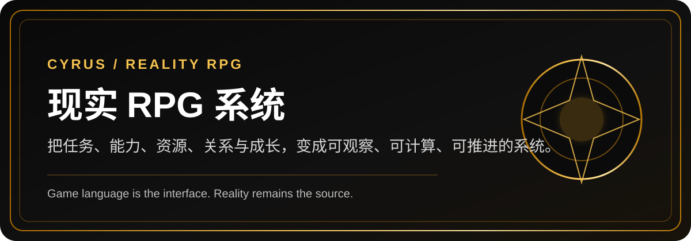
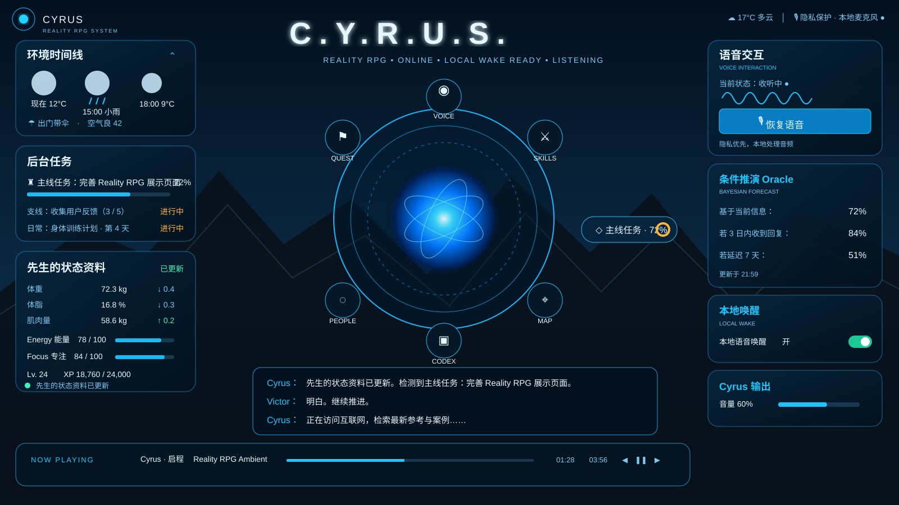
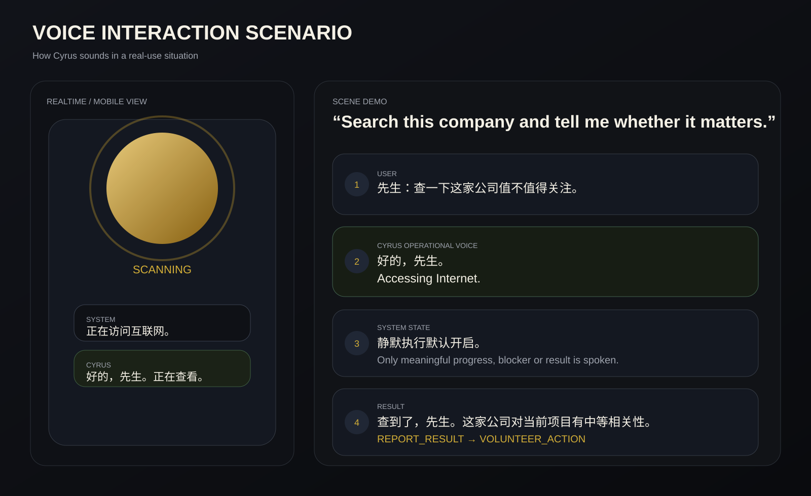

<p align="center">
  
</p>

<p align="center">
  <strong>把现实世界里的任务、能力、资源、关系、风险和成长，变成一套可观察、可计算、可推进的 RPG 系统。</strong>
</p>

<p align="center">
  
  
  
  
</p>

<p align="center">
  <a href="#它是什么">它是什么</a> ·
  <a href="#如果它真的可用会是什么体验">使用效果</a> ·
  <a href="#dashboard-preview">Dashboard</a> ·
  <a href="#语音交互情景演绎">语音交互</a> ·
  <a href="docs/SCENARIOS.md">Scenarios</a> ·
  <a href="docs/ROADMAP.md">Roadmap</a>
</p>

---

## 它是什么

**Reality RPG** 不是一款传统游戏。

它是一套把现实生活按照 RPG 的方式重新组织、量化和呈现的个人管理系统：任务可以成为 Quest，能力可以形成 Skill Tree，真实设备和资源可以进入 Equipment，重要经历可以解锁 Achievement，风险和结果则可以通过 Oracle 进行概率推演。

这套系统目前作为私人 AI 助理 **Cyrus** 的衍生功能进行设计。Cyrus 负责理解现实中的任务、数据和状态，Reality RPG 负责把这些信息压缩成更直观的 **HUD、Quest、Skill、Achievement、Map、People Network 和 Forecast**。

> **Game language is the interface. Reality remains the source.**  
> 游戏语言是界面，现实世界才是数据源。

它不会因为“像游戏”就把推测包装成事实。所有数字都尽量区分：

```text
MEASURED    实际测量
CALCULATED  公式计算
ESTIMATED   模型估计
```

所有信息状态也区分：

```text
CONFIRMED   已确认事实
REPORTED    当事人陈述
INFERRED    系统推断
FORECAST    概率预测
UNKNOWN     未知
WARNING     风险
```

---

## 如果它真的可用，会是什么体验

这套系统真正想解决的，不是“怎样把人生做成游戏”，而是：

- 我现在最该做什么？
- 一件事到底是 **重要**、**困难**，还是 **危险**？
- 我是在变强，还是只是在忙？
- 某个目标距离完成究竟还有多远？
- 我手上的资源、能力和关系，够不够支撑现在的计划？
- 如果我现在做 A 而不是 B，结果会差多少？

### 你能感受到的效果

#### 1. 任务不再只是待办，而是有结构的 Quest

你不会只看到“10 条待办”。

你会看到：

- 哪些是 **Q1 Critical**（重要且紧急）
- 哪些是 **Q2 Strategic**（重要但不紧急）
- 哪些任务被谁阻塞
- 哪些事情虽然难，但不一定危险
- 哪些任务其实不值得现在做

#### 2. 进度不再只是主观感觉，而是可视化状态

不是“最近好像有在推进”。

而是：

- Main Quest 目前 74%
- 当前瓶颈是什么
- 下一步行动是什么
- 成功概率在上升还是下降
- 为什么上升 / 为什么下降

#### 3. 成长不再只是零散记忆，而是长期记录

你可以看到：

- 身体指标变化
- 技能树的提升路径
- 资质和证书解锁了什么现实能力
- 关键 Achievement 和 Hidden Achievement
- 长期 Timeline 上哪些时刻值得记住

---

## 一个更直观的例子

假设你现在面对的是一个现实问题：

> 本周五前必须交一份关键资料，但还缺一个文件，对方回复又很慢。

普通待办工具只能告诉你：

> “别忘了星期五之前交。”

Reality RPG 会更像这样：

- 这是一个 **Q1 // CRITICAL** 任务
- Difficulty 是 **B+**，Danger 是 **IV**
- 当前最优选项不是“立刻乱交”，而是“先追缺失文件”
- 在当前条件下，成功概率是 **74%**
- 如果今天拿到缺失文件，成功概率会升到 **84%**
- 如果 24 小时内仍没回复，成功概率会降到 **51%**

也就是说，它不只是记录任务，而是开始帮你理解：

> **接下来什么动作最值钱。**

---

## Dashboard Preview

现实 RPG 最直接的使用体验，会先体现在 Dashboard / HUD 上。

### 主 Dashboard：把状态、主线、人物网络和风险放到同一张界面里

<p align="center">
  
</p>

这个界面里会同时看到：

- **Victor / Principal** 的当前状态
- Active Quests 的分布
- Main Quest 的进度和下一步目标
- Oracle 概率推演
- People / Network 的关系图
- Achievement、资源、地图等核心模块入口

它回答的不是“今天有多少任务”，而是：

> **现在的整体局势是什么。**

### 决策支持会长什么样

当你真的要做决策时，系统会继续往下走到 Quest + Oracle 这一层：

- 当前任务是什么
- 现在有哪些可行路径
- 每条路径的成功率 / 成本 / 可逆性如何
- 系统为什么建议你选 B 而不是 A
- 哪个变量最值得优先干预

这一部分的完整演示见：

- [Scenarios / 使用情景演示](docs/SCENARIOS.md)
- [Public Roadmap](docs/ROADMAP.md)

---

## 核心系统

### HUD

现实世界的即时信息层。它回答：

- 我现在是什么状态？
- 当前最重要的任务是什么？
- 有没有危险？
- 下一步应该做什么？

### Quest System

任务会被组织成：

- Main Quest
- Quest Chain
- Side Quest
- Training Quest
- Timed Quest
- Hidden Quest
- Boss Quest

并且显式区分：

- **Priority**：值得不值得现在处理
- **Difficulty**：事情本身有多难
- **Danger**：做错之后代价有多大

### Skills / Qualifications / Achievements

它们分别对应：

- **Skill**：你真实的能力结构
- **Qualification**：外部认证与资格解锁
- **Achievement**：值得被记住的里程碑

### People / Network / Map / Codex

现实中的人不会被叫做 NPC。

系统会使用：

- People / Contact / Stakeholder / Counterparty / Adviser / Team Member

并通过关系层级、互动记录和网络结构分析，帮助你看清：

- 谁是关键人物
- 哪些任务依赖同一个人
- 哪里出现了 Single Point of Failure

---

## Oracle + Quantification Engine

如果说 Quest System 解决的是“有什么事要做”，那么 **Oracle** 解决的是：

> **我现在这样做，成功概率有多大？**

而 **Quantification Engine** 解决的是：

> **哪些模糊问题，可以用更好的方法被量化和比较？**

它可能会用到：

- Bayesian inference / Bayesian update
- Expected Utility
- Monte Carlo
- PERT / Critical Path
- Expected Loss
- Elo / IRT
- Brier Score
- Dunbar Number
- Graph Analysis
- Opportunity Cost / Regret Analysis

这并不意味着系统会“装作什么都算得很准”。

恰恰相反，它会尽量明确：

- 这是不是事实
- 这是不是推断
- 这是不是条件预测
- 哪些假设一变，结论就会变

---

## 语音交互情景演绎

除了 Dashboard，另一个很重要的体验入口是 **Cyrus 的语音与实时交互**。

### 语音交互不是纯聊天，而是“助手 + 系统”的双层表达

- **System Language**：客观状态与 telemetry
- **Cyrus Operational Voice**：Cyrus 直接对你说话
- **Hybrid Event Announcement**：系统检测到事件，同时 Cyrus 汇报处理结果

例如：

```text
系统检测中……
正在访问互联网。
检测完成。

好的，先生。
查到了，先生。今天有三个相关事项。
```

### 场景预览

<p align="center">
  
</p>

这个场景展示的是：

1. 用户发出指令
2. Cyrus 用最简短的 Operational Voice 承接
3. 真正开始 Internet Search 时，系统可选择短暂播报 `Accessing Internet.`
4. 默认静默执行，不用冗长解释后台编排
5. 有结果后再汇报，并自然衔接下一步建议

这也是 Cyrus 的一个核心设计原则：

> **System underneath, personal assistant on the surface.**

看起来像一个简洁、稳定、可信的 AI 助手；底下其实是一整套状态模型、任务系统和量化引擎。

---

## 更多使用场景

如果你更想看“它会在现实里怎么帮助人”，可以直接看：

- [Scenarios / 使用情景演示](docs/SCENARIOS.md)
- [Public Roadmap](docs/ROADMAP.md)

Scenarios 会更偏向：

- 日常任务推进
- 截止日前的决策支持
- 健身与技能成长追踪
- 人物网络与资源判断
- 语音交互与后台执行体验

---

## 当前状态

这个项目当前仍然是 **公开概念展示 + 规划说明**。

已经完成的主要是：

- 产品结构与信息架构
- Reality RPG 的概念定义
- HUD / Quest / Skills / Achievements / People / Map / Codex / Intel 等模块设计
- Priority / Difficulty / Danger 体系
- Oracle / Conditional Forecast / Quantification Engine 方法框架
- Cyrus 的 System Language 与 Operational Voice 设计
- 公开 README、Roadmap 与 Scenario 展示

尚未全部实现的包括：

- 完整的可运行 Dashboard
- 实时数据流接入
- 真正可用的 Quantification Engine
- 语音 frontstage 与后台任务执行联动
- 长期 Forecast Calibration

所以它现在更准确的定位是：

> **一个正在逐步从概念走向系统实现的 Personal RPG / AI Life OS 项目。**

---

## Public Scope

这个仓库只用于公开介绍项目概念、体验方向与规划展示。

它 **不会** 公开：

- 个人隐私数据
- 私人任务记录
- 内部权限规则
- 私人 Source of Truth
- 私人 Cyrus 运行配置

如果你对这个方向感兴趣，最值得看的不是“它像不像游戏”，而是：

> **它能不能让现实生活里那些原本模糊、分散、难以追踪的状态，第一次真正变得可观察、可解释、可决策。**
