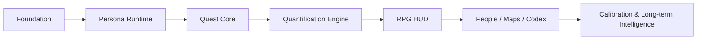

# Reality RPG — Public Roadmap

> 这是一份公开产品规划，用于展示方向与阶段目标。它不等同于私人 Cyrus 系统的内部工程计划，也不公开个人数据、内部权限配置或私人 Source of Truth。

[← 返回 README](../README.md)

---

## 总体路线



---

## Stage 0 — Foundation

**状态：大部分设计已完成**

目标：确定 Reality RPG 的产品语言、数据边界和核心对象。

- [x] RPG 作为现实状态的 Projection Layer，而不是另一套事实库
- [x] HUD 顶层信息架构
- [x] Quest / Skills / Assets / Qualifications / Achievements
- [x] People / Network / World Map / Codex / Timeline / Intel
- [x] Priority 四象限
- [x] Difficulty 与 Danger 分离
- [x] Oracle / Conditional Forecast 设计
- [x] Quantification Engine 方法框架
- [x] System Language / Operational Voice
- [x] Speech Act Taxonomy
- [x] Measured / Calculated / Estimated 真实性边界

### Exit condition

核心概念不再继续无限扩展；后续新增模块必须有真实使用场景。

---

## Stage 1 — Persona Runtime

**状态：下一阶段**

目标：让已经定案的 Cyrus 语言真正进入运行时，而不是只停留在设计文件。

重点：

- [ ] Speech Act → phrase selection
- [ ] 中文 / 英文分别渲染，不机械互译
- [ ] `明白，先生。` / `好的，先生。` / `是，先生。` 成为中文普通指令确认
- [ ] `Accessing Internet.` / `正在访问互联网。` 等真实访问状态
- [ ] 后台任务默认静默
- [ ] System Language 仅在真实状态发生时输出
- [ ] Action Claim Guard：没有证据时不得说“已完成 / 已发送 / Done”
- [ ] Voice / Realtime / Telegram 保持同一个 Cyrus 身份
- [ ] Regression fixtures 防止 Persona 漂移

### First dogfood

Internet Search + Background Execution。

这类任务天然能验证：

```text
ACKNOWLEDGE
→ ACCESSING
→ silent background work
→ BLOCK / WAITING / RESULT
→ ACTION COMPLETE
```

---

## Stage 2 — Quest Core

**状态：计划中**

目标：让现实任务真正进入 RPG Quest Model。

第一版只实现必要字段：

```text
Title
Type
Status
Priority Quadrant
Progress
Next Action
Deadline
Dependencies
Blockers
Waiting On
Difficulty
Danger
```

计划支持：

- [ ] Main Quest
- [ ] Quest Chain
- [ ] Side Quest
- [ ] Timed Quest
- [ ] Training Quest
- [ ] Event Quest
- [ ] Hidden Quest
- [ ] Boss Quest
- [ ] Maintenance Quest

### 原则

Quest 是现有任务事实的投影，不维护一份互相竞争的任务数据库。

---

## Stage 3 — Quantification Engine v0

**状态：计划中**

目标：优先实现真正能改变行动顺序的量化能力，而不是一次性实现所有方法论。

### v0 首批模块

- [ ] Priority Engine
- [ ] Difficulty Engine
- [ ] Danger / Risk Engine
- [ ] Progress Engine
- [ ] Oracle / Conditional Forecast

### Oracle v0

最小输出：

```text
Target Event
Time Horizon
Known Conditions
Model Assumptions
Scenario Assumptions
Prior
New Evidence
Posterior
Confidence
Main Uncertainty
Update Trigger
```

### 后续候选方法

按真实需求逐步加入：

- Bayesian update
- Expected Utility / MCDA
- Monte Carlo
- PERT / Critical Path
- Expected Loss / FMEA
- Elo / IRT
- Survival Analysis
- Graph Analysis
- Opportunity Cost
- Regret Analysis
- Option Value

**不建立没有消费者的数学模块。**

---

## Stage 4 — RPG HUD / Dashboard

**状态：设计定案，实施待后续**

目标：让 Quest、状态、资源和预测第一次在一个统一界面中可见。

计划顶层页面：

```text
HOME / HUD
QUEST LOG
VICTOR / PRINCIPAL
SKILLS
ASSETS / EQUIPMENT
QUALIFICATIONS
ACHIEVEMENTS
PEOPLE / NETWORK
WORLD / MISSION MAP
ORACLE
CODEX
TIMELINE
INTEL
SYSTEM
```

### HUD v1 优先显示

- 当前主线
- 下一步行动
- Q1 / Critical 项目
- Blocked / Waiting
- 任务进度
- Resource Gap
- Danger
- Conditional Success Probability
- 关键系统状态

完整 RPG 视觉不会优先于真实数据流。

---

## Stage 5 — Skills / Achievements / Qualifications

**状态：部分已有数据基础，产品化计划中**

### Skills

- [ ] 多维技能树
- [ ] Evidence-based progression
- [ ] Introduced / Practising / Operational / Mastered 等能力状态
- [ ] Training Quest 联动

### Achievements

- [ ] 预设成就
- [ ] PR / Personal Record 自动检测
- [ ] First-time milestone
- [ ] Hidden Achievement
- [ ] Achievement Timeline

### Qualifications

- [ ] Issuer / Level / Result / Grade
- [ ] Evidence / Verification
- [ ] Expiry
- [ ] Unlocks

---

## Stage 6 — People Network & Maps

**状态：规划中**

目标：把人物、任务和现实位置形成真正的关系图谱。

### People Network

- [ ] Dunbar-style relationship rings
- [ ] Relationship roles
- [ ] Recency / interaction state
- [ ] Dependency detection
- [ ] Graph centrality / bridge detection（有真实价值时）

### Maps

- [ ] Physical Map
- [ ] Mission Dependency Map
- [ ] Strategic Map
- [ ] Resource / Objective / Risk overlay

---

## Stage 7 — Codex / Timeline / Intel

**状态：规划中**

目标：从“管理今天”升级到“理解长期人生状态”。

### Codex

```text
People
Organisations
Places
Assets
Events
Knowledge
System
```

### Timeline

记录重要：

- Quest Completion
- Achievement
- Qualification
- Personal Record
- Major Decision
- Major Event

### Intel

长期维护：

```text
CONFIRMED
REPORTED
INFERRED
FORECAST
UNKNOWN
WARNING
```

---

## Stage 8 — Forecast Calibration

**状态：长期方向**

目标：让概率预测不只是“看起来专业”，而是随着真实结果逐渐校准。

计划：

- [ ] Forecast history
- [ ] Resolved outcome tracking
- [ ] Brier Score
- [ ] Calibration buckets
- [ ] Victor-specific empirical priors
- [ ] Sensitivity analysis

最终希望做到：

> 当系统说“70%”时，长期来看真的接近十次中发生七次。

---

# 产品原则

整个 Roadmap 受下面几条原则约束：

1. **Reality is the Source of Truth.**
2. **RPG is a projection, not a second reality.**
3. **Estimate is not measurement.**
4. **Progress is not success probability.**
5. **Difficulty is not danger.**
6. **System language must reflect real system state.**
7. **Silent execution is better than narrating internal orchestration.**
8. **Build the smallest useful engine first.**
9. **No fake player statistics or fake rarity.**
10. **A beautiful HUD is useless without live data.**

---

## 当前一句话状态

> **核心产品设计已定案；当前重点是把 Persona、后台执行和 Internet Search 接到真实运行时，再从 Quest Core 开始逐步形成真正的 Reality RPG。**
